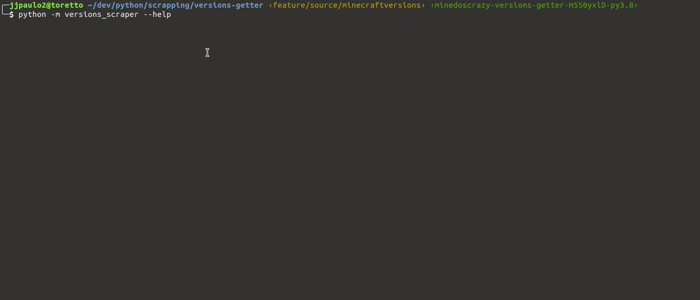

# Scraper de versões do Minecraft

Este projeto contém scripts de raspagem de dados que extraem dados de versões do Minecraft de alguns sites. A ideia é ter uma ferramenta fácil de usar e capaz de extrair esses dados sempre que preciso de fontes (que não sejam diretamente o `version_manifest.json` da Mojang). No fundo é um projeto apenas para se divertir.



### Dependências

Este projeto usa o **Poetry** como gerenciador de dependências padrão, mas se você não usa ele existe um arquivo `requirements.txt` que contém todas as dependências necessárias para fazer o projeto rodar.

```shell
$ pip install -r requirements.txt
``` 

### Fontes dos dados

Você pode encontrar as fontes de extração no arquivo `versions_scraper/origin.py`.

| Site | Implementação | Funcionando |
|-|-|-|
| https://minecraftversions.com | Concluída | Sim |
| https://mcversions.net | Pendente | - |

### Uso

Após instalar as dependências, basta acionar o módulo python através da linha de comando. Você será questionado sobre qual fonte usar para a extração dos dados. Assim que a extração terminar, será gerado um arquivo `versions.json` no diretório em que você estiver.

```shell
$ python -m versions_scraper --scrape
```

Sinta-se à vontade para contribuir para o projeto incluindo novas fontes de extração. Basta seguir o padrão de implementação da classe [`versions_scraper.sources.Source`](./versions_scraper/sources/__init__.py).